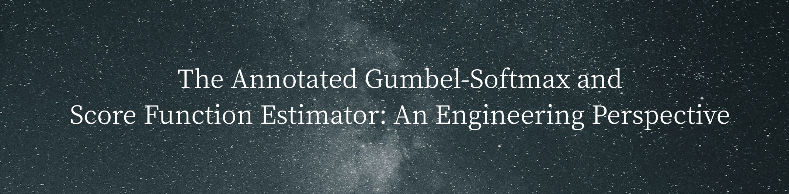

# The Annotated Gumbel Softmax and Score Function Estimator: An Engineering Perspective

Yao Fu, Columbia University 

yao.fu@columbia.edu



----

The gumbel-softmax and the score function estimator (a.k.a REINFORCE/ policy gradient) are the two most widely used estimators for back-propagating gradients through non-differentiable variables.
In NLP this typically means discrete structures, typically categorical variables, linear chains, trees .etc. 
with the parameterization by HMMs, CRFs and neural networks. 
To show the implementation details, to study the basic behaviors of the two estimators from an engineering perspective, to give people what to expect, and to show the best practice, we present the annotated notebooks for them. 

Specifically, we focus on **hyper-parameter tuning** and the corresponding output.

The annotated gumbel-softmax ([html](https://franxyao.github.io/blog/annotated_gumbel.html), [ipynb](https://github.com/FranxYao/Annotated-Gumbel-Softmax-and-Score-Function/blob/master/src/annotated_gumbel.ipynb))

The annotated score function estimator([html](https://franxyao.github.io/blog/annotated_score_function.html), [ipynb](https://github.com/FranxYao/Annotated-Gumbel-Softmax-and-Score-Function/blob/master/src/annotated_score_function.ipynb))

Citation:

```
@article{yao2020annotated_gumbel_score,
  title   = "The Annotated Gumbel Softmax and Score Function Estimator",
  author  = "Yao Fu",
  year    = "2020",
  url     = "https://github.com/FranxYao/Annotated-Gumbel-Softmax-and-Score-Function"
}
```

Related Works:
* Jang, Gu, and Poole. Categorical Reparameterization with Gumbel-Softmax. ICLR 2017 ([link](https://arxiv.org/abs/1611.01144))
* Maddison, Mnih, and Teh. The Concrete Distribution: A Continuous Relaxation of Discrete Random Variables. ICLR 2017 ([link](https://arxiv.org/abs/1611.00712))
* Ranganath, Gerrish, and Blei. Black-box Variational Inference. AISTATS 2014 ([link](https://arxiv.org/pdf/1401.0118.pdf))
* Aziz. Score Function Estimator and Variance Reduction Techniques. 2018 ([link](http://wilkeraziz.github.io/slides/24-05-2018-uedin-dgm-discrete.pdf))